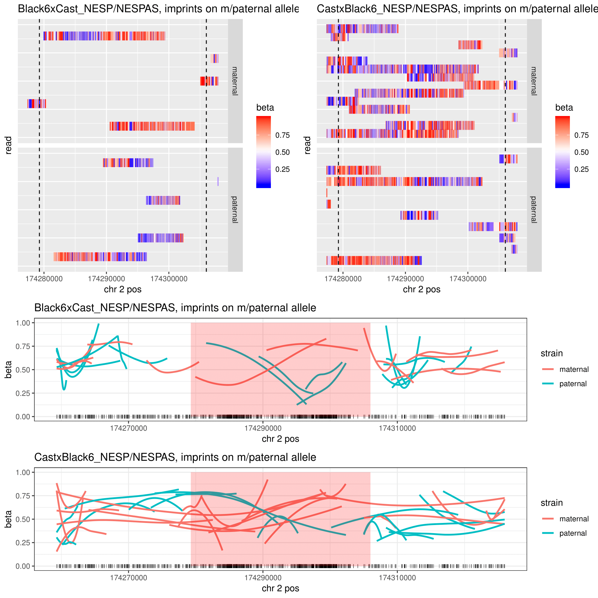
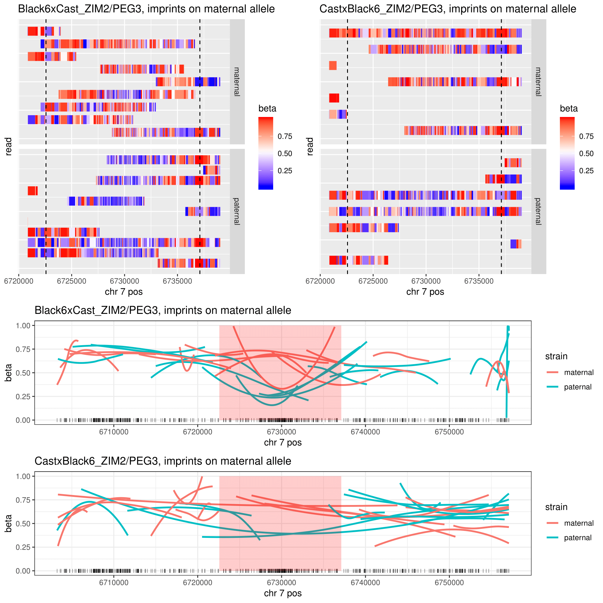

# Imprinted Methylation

Exercise to reproduce the results from __Gigante et al., 2018: Using long-read sequencing to detect imprinted DNA methylation__. For more detailed information, please see the original author's work at his [repo](https://github.com/scottgigante/haplotyped-methylome)

This repo contains scripts and notebooks used for:

- mapping reads to reference genome
- haplotyping reads (to paternal or maternal strain)
- tombo resquiggling
- call methylation with tombo and nanopolish
- plot per-read methylation patterns at known ICRs
- detect novel DMRs

## Example

1. NESP/NESPAS

2. ZIM2/PEG

